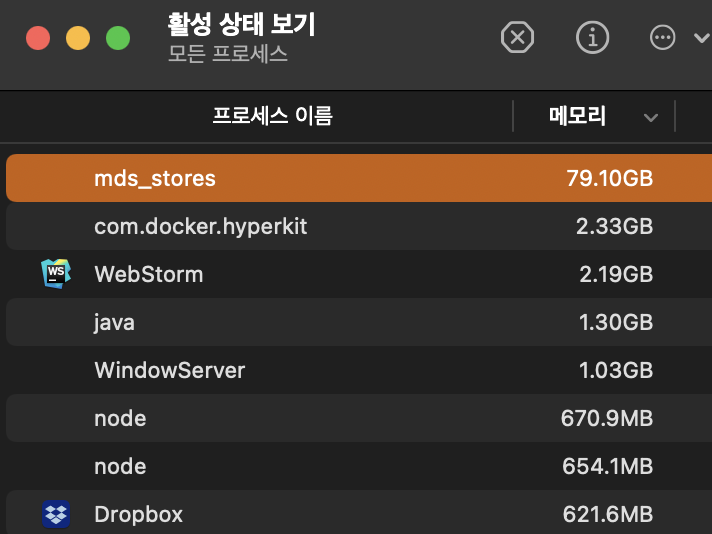
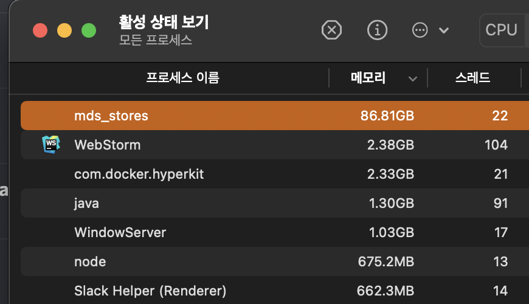
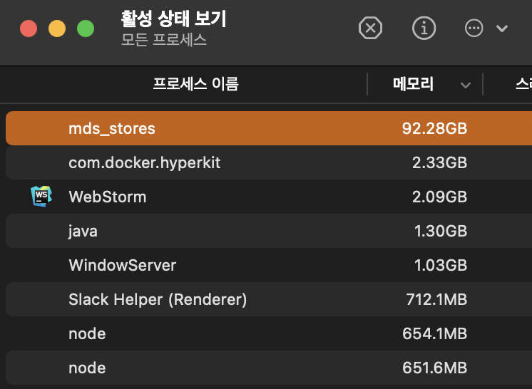
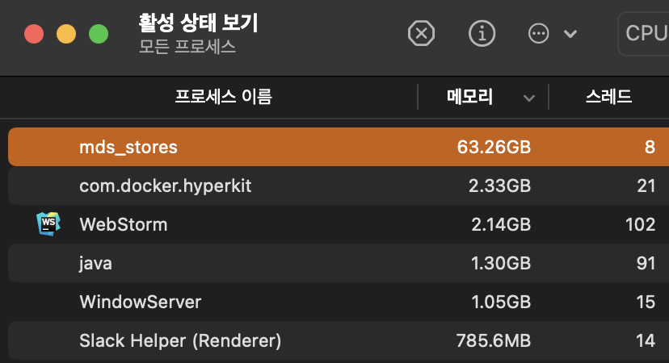

오늘 맥북을 쓰는 도중, 별 작업을 하지 않고 있는데도 팬이 열심히 돌길래 프로세스를 확인해봤다.

`mds_stores`라는 이름의 프로세스가 메모리를 80기가나 사용하고 있던게 원인이었다. 재밌어서 어디까지 올라가나 지켜봤다.

아쉽게도 93기가 이후 램 사용량이 급락해 60기가 근처까지 떨어졌다...

이후 저 프로세스는 죽여버렸다. 베타라 이런 버그가 발생한건지 아닌지는 잘 모르겠다. 요즘 운영체제들이 램 관리 하나는 진짜 잘하는 듯.
