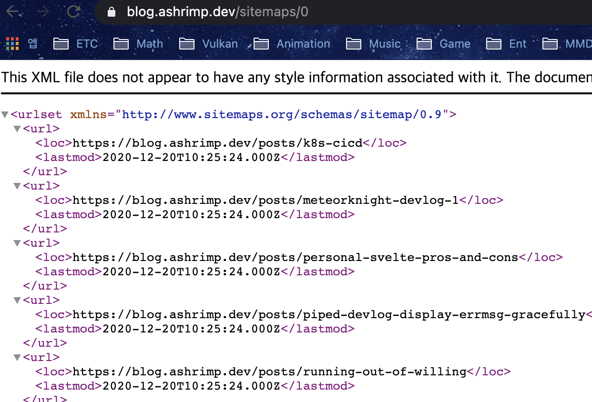
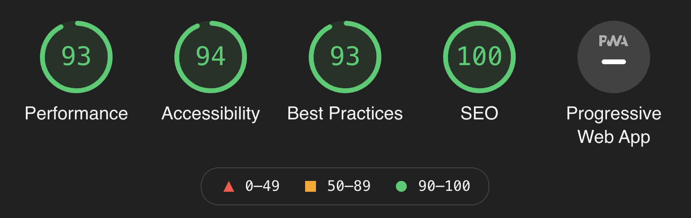

저번부터 계속 만들어 오던 이 블로그도 대충 그럴싸해졌다. 근데 블로그란 것이 검색 엔진에 노출이 되지 않으면 의미가 없지 않나? 그래서 부랴부랴 백엔드에 사이트맵 지원 추가하고, nginx 세팅하고 구글 Search Console에 사이트맵을 제출했다.



근데 결과가 엉망이었다. 생각해보니 이 블로그는 SPA라서(2021년 12월 현재는 아닙니다), 전체적으로 자바스크립트로 제어된다. 이게 무슨 말이냐면, 자바스크립트가 돌지 않으면 아무런 내용도 없는 빈 깡통이라는 말이다. 아니 어떻게 만든 블로그인데! 그래서 SSR을 붙이기로 했다. SSR을 적용하면 첫 페이지 요청시에 서버가 자바스크립트를 대신 실행해 DOM을 생성한 뒤 이걸 스크립트와 같이 보내준다. 만약 클라이언트가 자바스크립트를 지원한다면, 같이 받아온 스크립트를 실행해 DOM 위에 스크립트를 입혀(hydrate라고 표현한다) CSR로 전환한다. 클라이언트가 자바스크립트를 지원하지 않는다면(예를 들면 크롤러), 그냥 DOM을 사용하면 된다. 이렇게 하면 첫 페이지 로드도 엄청나게 빨라진다! 근데 구현하는데 생각보다 시간이 오래 걸렸다. 어떻게 동작하는지는 알지만, 그래서 어떻게 만들어야 하는지는 몰랐기 때문이다. 그럼 내가 어떤 과정을 거쳐서 구현할 수 있었는지 알아보자.

# jsdom

routify의 코드를 까본 결과, SSR을 위해서 [jsdom](https://github.com/jsdom/jsdom)을 사용하는 것을 확인할 수 있었다. 즉 다시 말해서, headless 브라우저처럼 동작하는 jsdom을 서버상에서 실행시켜 렌더링된 DOM을 얻어내는 것이다.

1. index.html을 jsdom으로 읽어서 가상의 브라우저 환경을 만든다.
1. 페이지가 준비되었다는 이벤트(이 이벤트는 프론트엔드 코드에서 trigger하면 된다)를 수신받기 위한 이벤트 핸들러를 DOM에 붙인다.
1. index.html에 있던 스크립트를 실행한다.
1. 스크립트에 의해 수정된 DOM을 serialize해 문자열로 얻어낸다.
1. 필요하다면 CSR 전환을 위한 부가적인 스크립트를 body 하단에 첨부한다.

이제 완성된 문자열을 `text/html` 형태로 클라이언트에게 던지면 된다. 생각보다 어렵지 않다!

# Backend

위 접근 방법 그대로 구현해보자. 참고로 내 블로그는 nestjs를 사용하고 있다.

```javascript
@Controller()
export class ViewSSRController {
  private readonly frontendEvent: string;
  private readonly indexHTML: string;
  private readonly scripts: string[];
  private readonly attachments: string[];
  private readonly timeout: number;

  constructor() {
    const frontendDir = process.env.SSR_FRONTEND_DIR || process.cwd();
    this.frontendEvent = process.env.SSR_FRONTEND_EVENT || 'app-loaded';
    this.indexHTML = fs.readFileSync(
      path.join(frontendDir, 'index.html'),
      'utf-8'
    );
    this.scripts = (process.env.SSR_FRONTEND_SCRIPTS || '')
      .split(',')
      .map((script) =>
        fs.readFileSync(path.join(frontendDir, script.trim()), 'utf-8')
      );
    this.attachments = (process.env.SSR_FRONTEND_SCRIPT_ATTACHMENTS || '')
      .split(',')
      .map((attachment) => attachment.trim());
    this.timeout = Number(process.env.SSR_FRONTEND_TIMEOUT || 5000);
  }

  @Get('ssr/:path(*)?')
  @Header('Content-Type', 'text/html')
  @Header(
    'Content-Security-Policy',
    "default-src 'self' https:; img-src 'self' http: data:; script-src 'self'; style-src 'unsafe-inline' 'self' https:;"
  )
  async generateSSRPage(
    @Param('path', new OptionalPipe(new StringPipe(Number.MAX_VALUE, true)))
    path: string | undefined
  ): Promise<string> {
    path = path ?? '';

    return new Promise((resolve, reject) => {
      const dom = new JSDOM(this.indexHTML, {
        runScripts: 'outside-only',
        url: `${process.env.SSR_FRONTEND_URL}${path}`,
      });

      // Poly-fill some window functions here.
      dom.window.scrollTo = () => {};

      const timeout = setTimeout(() => reject('timeout'), this.timeout);

      dom.window.addEventListener(this.frontendEvent, () => {
        clearTimeout(timeout);

        for (const attachment of this.attachments) {
          const script = dom.window.document.createElement('script');
          script.src = attachment;
          dom.window.document.body.appendChild(script);
        }

        resolve(dom.serialize());
      });

      // Remove all pre-existing scripts.
      const scripts = dom.window.document.getElementsByTagName('script');

      for (let index = scripts.length - 1; 0 <= index; --index)
        scripts[index].parentNode?.removeChild(scripts[index]);

      try {
        for (const script of this.scripts)
          dom.window.eval(script);
      } catch (err) {
        reject('error');
      }
    });
  }
}
```

위 서술과 차이가 있다면 예외 처리를 위한 일부 로직의 추가와 유연한 설정을 위한 환경변수 정도가 있겠다. 이 상태로 몇 일간 사용해 봤는데 상당히 괜찮았다. 배포가 좀 귀찮아지긴 하지만. 이 부분은 빌드 설정을 다시 만져서 개선할 예정이다.

# Frontend

프론트엔드 구현시 약간의 주의 사항이 있다.

- 페이지 로드 완료시 반드시 이벤트를 발생시켜야 한다. 나의 경우 routify를 사용하고 있었기 때문에 여기서 제공하는 기능을 사용해서 간단히 해결했다. 하지만 그렇지 않은 경우더라도 커스텀 이벤트만 잘 발생시키면 되니 어려울 것은 없다. 요는 어떻게든 DOM 밖에서 페이지가 모두 로드되었음을 알 수 있어야 한다는 것.
- Svelte 기준으로, webpack 빌드시 반드시 컴파일러 옵션에 `hydratable: true`를 줘야 한다. 이게 없으면 hydrate가 불가능해 DOM이 두 개가 생긴다.
- 역시 Svelte 기준으로, SSR용 프론트엔드와 CSR용 프론트엔드 총 두 개의 독립된 빌드가 필요하다. 왜냐하면, SSR시에는 루트 컴포넌트를 `target` 옵션을 이용해 바인딩할 때 `hydrate`를 켜면 **안되기 때문**이다. 이는 SSR시에는 DOM이 없는 상태에서 DOM을 생성하려는 목적에서 실행하는 것이므로 hydrate가 불가능해서 그런데, 반대로 CSR용 프론트엔드에서는 스크립트와 함께 받은 DOM 위에서 컴포넌트를 바인딩하는 것이므로 hydrate를 해야한다. 즉 정리하면, 루트 컴포넌트를 바인딩할 때 SSR용 빌드에서는 `hydrate: false` 옵션(또는 아예 주지 않기)을, CSR용 빌드에서는 `hydrate: true` 옵션을 주어야 한다는 것이다. 둘이 생성되는 결과물이 다르다.

# Conclusion

이렇게 SSR을 힘겹게 적용한 효과는 굉장했다. DOM이 잘 생성되면서도 CSR로 자연스럽게 이전된다. 페이지를 로드하고 난 이후에는 클라이언트가 더이상 페이지를 요청하지 않는다는 말이다. 페이지 로드 속도도 엄청 빨라졌다.



초록색 점수를 보니 기분이 좋아진다. 이후에는 CDN을 적용했는데, 이 내용은 다음에 다뤄야겠다.
