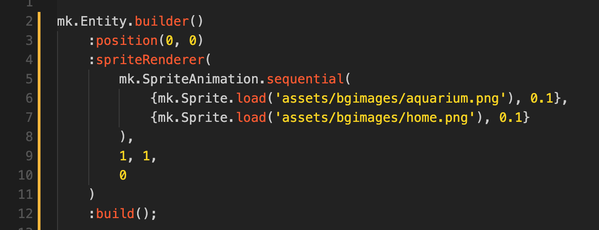

유성기사를 개발하기 시작한 뒤로 벌써 시간이 많이 흘렀다. 그동안 엔진도 몇 번 바꿨는데, 처음에는 유니티로 개발했지만 좀 불편하기도 하고 (특히 애니메이션이 그랬다) 색다른 개발을 해보고 싶어서 엔진을 자체 제작하기로 했다. 엔진은 Rust를, 스크립팅 언어로는 Lua를 선택했고, 객체 관리는 게임 개발에서 많이 사용되는 ECS(Entity Component System)를 채택했다. Rust에서 Lua 바인딩을 bindgen으로 직접 하려고 했지만 불어나는 unsafe 코드와 LoC를 보고 [mlua](https://github.com/khvzak/mlua)로 선회했다. 현재 엔진 기능은 테스트가 가능한 정도는 만들었고, Lua API를 구현하는데 집중하고 있다.

